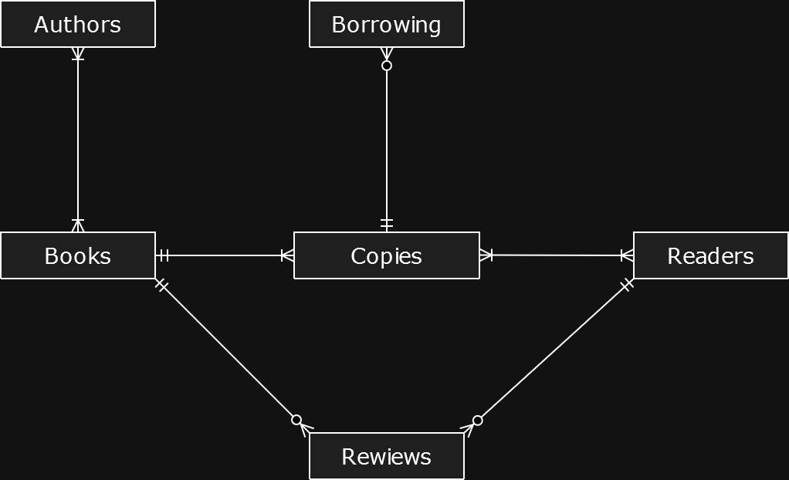
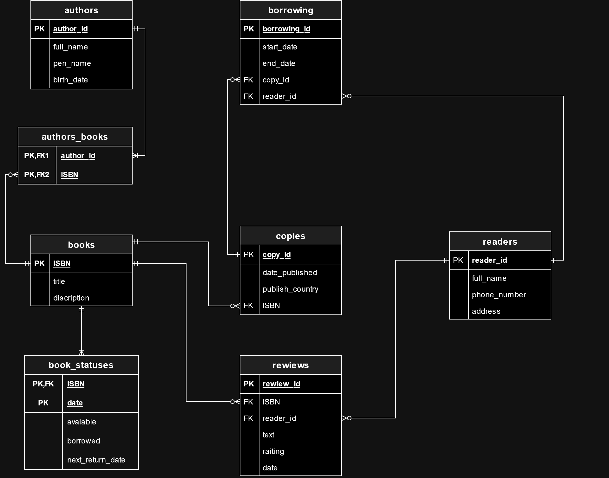
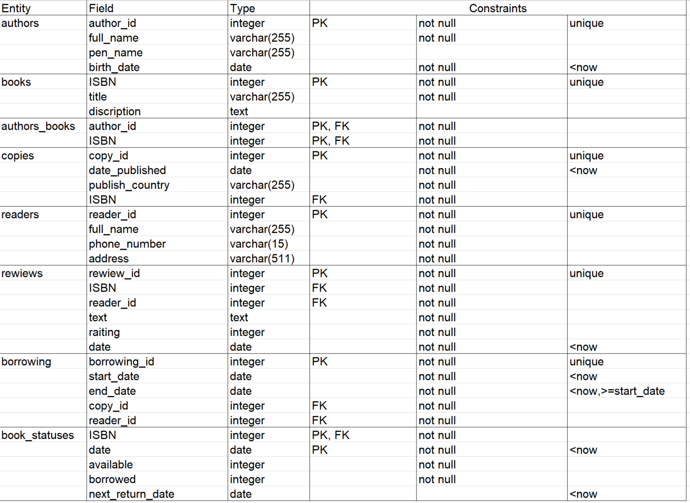

# Тема проекта: База данных "Библиотека"
Проект направлен на создание базы данных для управления информацией в библиотеке. Основная цель — упростить хранение и обработку данных о книгах, авторах, читателях, а также отслеживание статусов книг и процесса их выдачи.

# Кому может быть полезен проект

1. Администраторы библиотек:
   - Управление книгами, авторами, читателями и копиями книг.
   - Мониторинг статусов книг и обработка возвратов/выдач.

2. Сотрудники библиотек:
   - Обеспечение точного учета наличия и состояния книг.
   - Упрощение процесса выдачи и возврата книг.

3. Читатели:
   - Возможность получать информацию о доступных экземплярах и отзывах на них.

# Описание таблиц и их назначения

1. authors:
   - Содержит информацию об авторах книг: уникальный идентификатор автора, полное имя, псевдоним, дата рождения.

2. books:
   - Содержит информацию о книгах: уникальный идентификатор ISBN, название книги, описание.
   
3. authors_books:
   - Связующая таблица, отображающая связи авторов с книгами. 

4. copies:
   - Содержит копии книг, которые существуют в библиотеке: уникальный идентификатор копии, дата публикации, страна публикации, ISBN книги.
     
5. readers:
   - Содержит информацию о читателях библиотечных книг: уникальный идентификатор читателя, полное имя, номер телефона, адрес.

6. reviews:
   - Содержит отзывы на книги: уникальный идентификатор отзыва, ISBN книги, идентификатор читателя, текст отзыва, рейтинг от 1 до 5, дата отзыва.
   
7. borrowing:
   - Содержит информацию о процессе выдачи книг читателям: уникальный идентификатор выдачи, дата начала и окончания выдачи, идентификатор копии книги, идентификатор читателя.

8. book_statuses:
   - Версионная таблица для отслеживания статуса книг: уникальный идентификатор книги (ISBN), дата обновления статуса, количество доступных и занятых экземпляров, дата следующего возврата (если существует)

# Концептуальная модель

# Логическая модель

# Физическая модель

