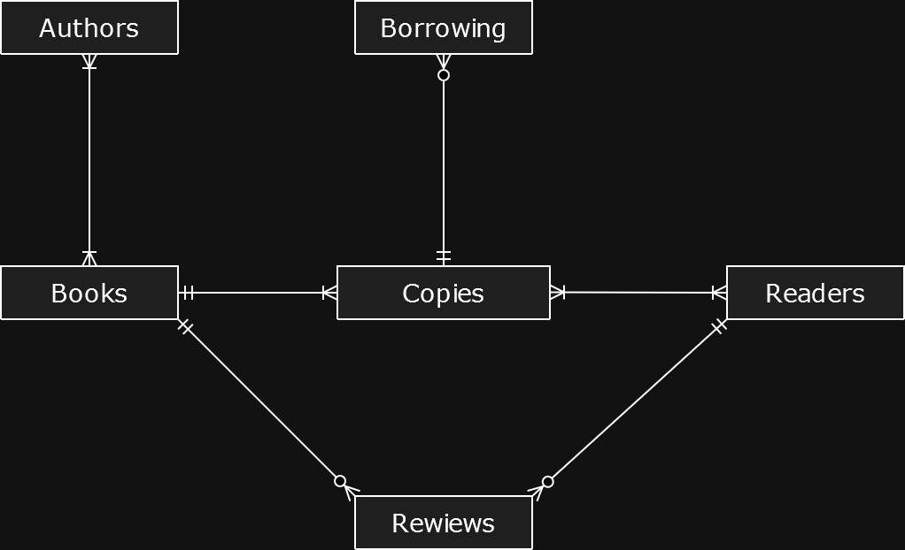
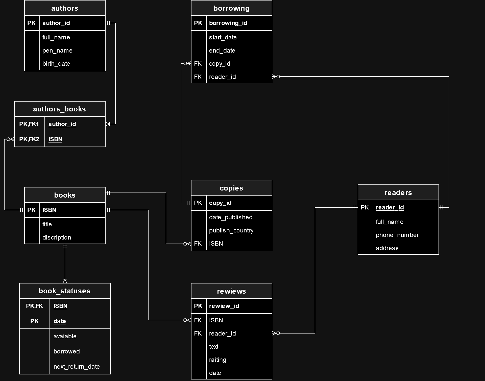
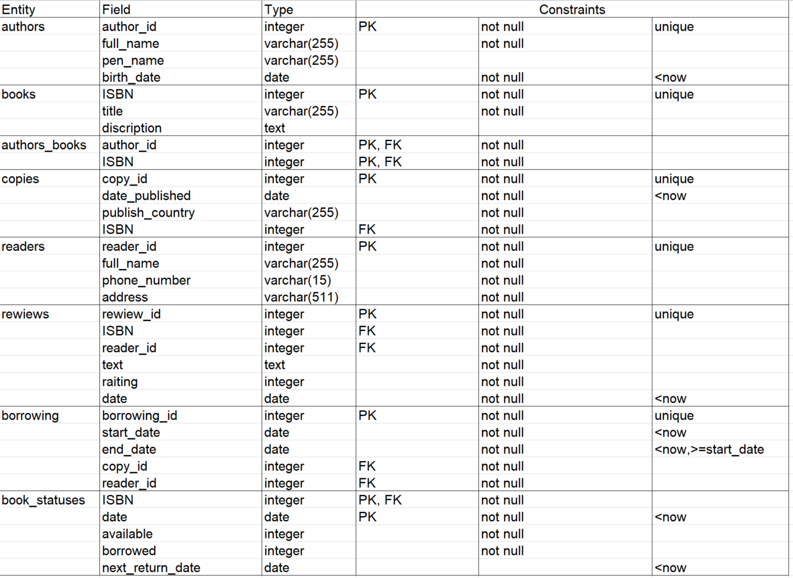

# Тема проекта: База данных "Библиотека"
Проект направлен на создание базы данных для управления информацией в библиотеке. Основная цель — упростить хранение и обработку данных о книгах, авторах, читателях, а также отслеживание статусов книг и процесса их выдачи.

# Кому может быть полезен проект

1. Администраторы библиотек:
   - Управление книгами, авторами, читателями и копиями книг.
   - Мониторинг статусов книг и обработка возвратов/выдач.

2. Сотрудники библиотек:
   - Обеспечение точного учета наличия и состояния книг.
   - Упрощение процесса выдачи и возврата книг.

3. Читатели:
   - Возможность получать информацию о доступных экземплярах и отзывах на них.

# Описание таблиц и их назначения

1. authors:
   - Содержит информацию об авторах книг: уникальный идентификатор автора, полное имя, псевдоним, дата рождения.

2. books:
   - Содержит информацию о книгах: уникальный идентификатор ISBN, название книги, описание.
   
3. authors_books:
   - Связующая таблица, отображающая связи авторов с книгами. 

4. copies:
   - Содержит копии книг, которые существуют в библиотеке: уникальный идентификатор копии, дата публикации, страна публикации, ISBN книги.
     
5. readers:
   - Содержит информацию о читателях библиотечных книг: уникальный идентификатор читателя, полное имя, номер телефона, адрес.

6. reviews:
   - Содержит отзывы на книги: уникальный идентификатор отзыва, ISBN книги, идентификатор читателя, текст отзыва, рейтинг от 1 до 5, дата отзыва.
   
7. borrowing:
   - Содержит информацию о процессе выдачи книг читателям: уникальный идентификатор выдачи, дата начала и окончания выдачи, идентификатор копии книги, идентификатор читателя.

8. book_statuses:
   - Версионная таблица для отслеживания статуса книг: уникальный идентификатор книги (ISBN), дата обновления статуса, количество доступных и занятых экземпляров, дата следующего возврата (если существует)

# Концептуальная модель

# Логическая модель

# Физическая модель

# Проектирование приложения
Данный раздел посвящен описанию приложения, реализующего описанные ранее автоматизированные функции.

5.1 Подключение к источнику данных

Работа с программой начинается с подключения к SQL серверу, хранящему спроектированную ранее базу данных. Для подключения к серверу используется форма «Авторизация» (см. рисунок 5.1).

5.2 Рабочая область приложения для преподавателей и руководства

В зависимости от роли пользователя (Читатель/Преподаватель/Руководство) на форме будут отображаться (либо скрываться) некоторые вкладки.  Рассмотрим подробнее.

Читателю доступна только вкладка “Книги”, где он может искать различные книги по названию либо по автору. Двойным нажатием можно открыть окно с подробной информацией о книге и отзывами. 

Сотруднику становятся доступны ещё 3 вкладки: “Выдача книг”, “Возврат книг” и “Управление каталогом”.

На вкладке “Выдача книг” нужно выбрать книгу и читателя из таблиц, кликнув по ним. Затем выбрать копию книги, тогда кнопка “Выдать книгу” станет доступной и при успешной выдаче будет уведомление. Для удобства сделан поиск книг и читателей.

На вкладке “Возврат книг” нужно выбрать книгу из таблицы, кликнув по ней. Затем при нажатии кнопки “Вернуть” книга будет считаться возвращённой и выйдет соответствующее уведомление.

На вкладке “Управление каталогом” нужно выбрать книгу из таблицы, кликнув по ней. Затем в других двух таблицах отобразятся соответствующие ей копии и авторы. Можно добавить копию/автора нажатием соответствующей кнопки, либо удалить, кнопка удаления становится доступной после выбора элемента в соответствующей таблице. Также можно удалять или добавлять сами книги.

Руководству становятся доступны ещё 2 вкладки: “Назначение сотрудников” и “Отчёты по книгам”.
На вкладке “Назначение сотрудников” нужно выбрать пользователя из таблицы, кликнув по нему, выбрать нужную роль, и при нажатии на кнопку “Сохранить” роль выбранного пользователя будет изменена.

На вкладке “Отчёты по книгам” отображается количество экземпляров и сколько из них находится у читателей, и сколько лежит в библиотеке. Есть поиск по названию книги для удобства.